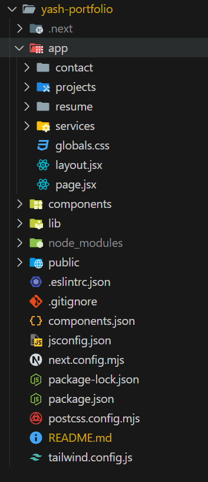

# Yash's Portfolio (Under Construction 🚧)

This repository contains the source code for my personal portfolio website, showcasing my projects, skills, and experiences. The site is designed to provide a comprehensive overview of my professional background, including projects, skills, and contact options.

## Table of Contents

- [Features](#features)
- [Technologies](#technologies)
- [Installation](#installation)
- [Usage](#usage)
- [File Structure](#file-structure)
- [Contributing](#contributing)
- [License](#license)

## Features

- **Responsive Design**: Optimized for devices of all sizes, including mobile, tablet, and desktop.
- **Project Showcase**: Displays projects with descriptions, images, and links.
- **Skills Section**: Highlights key technical and professional skills.
- **Contact Form**: Allows visitors to contact me directly via the website.

## Technologies

The website is built with the following stack:

- **Framework**: [Next.js](https://nextjs.org/) (React framework)
- **Frontend**:
  - **React** for UI components
  - **Tailwind CSS** for styling and **Tailwind CSS Animate** for animations
  - **Framer Motion** for animations
  - **Swiper** for interactive, swipeable sliders
  - **Radix UI** components for accessible, customizable UI elements
  - **React Icons** and **Lucide React** for icon sets
  - **clsx** and **tailwind-merge** for conditional class management and style merging
- **Development Tools**:
  - **ESLint** for linting
  - **PostCSS** for processing CSS

## Installation

1. **Clone the repository**:
```
git clone https://github.com/yourusername/yash-portfolio.git
```
2. **Navigate to the project directory**:
```
cd yash-portfolio
```
3. **Install dependencies**:
```
npm install
```

## Usage

1. **Run the project locally**:
```
npm run dev
``` 

2. Open your browser and navigate to http://localhost:3000 to see the portfolio.

## File Structure
Here's a basic outline of the project's folder structure:



## Contributing
If you would like to contribute to this project, please fork the repository and submit a pull request. Issues and suggestions are also welcome!


